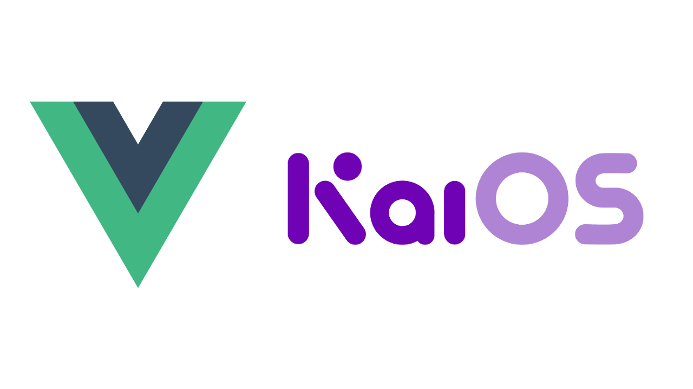

# Vue KaiUI
Vue component library for KaiOS apps. All components and views are navigable using a phone's d-pad and softkeys.

## Installation
```
npm install vue-kaiui
```
In your `main.js` add

```javascript
import Vue from 'vue'
import App from './App.vue'

import VueKaiUI from "vue-kaiui"; // !
Vue.use(VueKaiUI) // !

new Vue({
  render: h => h(App),
}).$mount('#app')
```

## Usage / API
See the [API docs](https://github.com/sebastianbaar/vue-kaiui/docs/API.md) and the [sample App](https://github.com/sebastianbaar/vue-kaiui-sample) for usage examples.

### Styles
You can simply override CSS Variables in your `App.vue`. Theme CSS Variables are found [here](https://github.com/sebastianbaar/vue-kaiui/tree/master/src/assets/css/theme.css).

```css
<style>

:root{
  --primary-color: red;
  ...
  --tabbar-tabs-selected-color: blue;
  ...
}

</style>
```

## Status (see [Contributing](#contributing))

### [Components](https://developer.kaiostech.com/design-guide/ui-component)
- [x] Header
- [x] Tab
- [x] Software Key
- [x] List Item
- [x] Separator
- [x] Checkbox
- [x] Button
- [x] Input
- [x] Multiple-line Input
- [x] Toast
- [ ] Radio Button (Group)
- [ ] Progress
- [ ] Slider (update Design!)
- [ ] Option Menu
- [ ] Value Selector
- [ ] Dialog
- [ ] Notice
### [Navigation](https://developer.kaiostech.com/design-guide/basic-navigation)
- [x] List View
- [x] Tab View
- [ ] Grid View
### [Typography](https://developer.kaiostech.com/design-guide/typography)
- [x] Fonts
- [x] KaiOS Icons
### Miscellaneous
- [ ] [Theming](https://developer.kaiostech.com/getting-started/build-your-first-package-app/sample-code#theme-apps)
- [ ] [Translation](https://developer.kaiostech.com/getting-started/build-your-first-package-app/sample-code#apps-with-translation--l10n)
- [ ] [LargeText](https://developer.kaiostech.com/api/largetext)
- [ ] [Portrait/Landscape Mode](https://developer.kaiostech.com/core-developer-topics/supporting-multiple)


## Notifications

Notifications are provided by KaiOS itself when you use the standard [Notifications API](https://developer.mozilla.org/en-US/docs/Web/API/notification) while your app is running, or the [Push API](https://developer.mozilla.org/en-US/docs/Web/API/Push_API) if you want push notifications. Installed apps need to request permission for this through the manifest file. Just add this line to the permissions section of your `manifest.webapp` file.

```
"desktop-notification": {}
```

Once this is added, you can send the user notifications without needing to request permission.

## Styling, Colors, Fonts

Typography details can be found [here](https://developer.kaiostech.com/design-guide/typography).

Standardized stylings, colors and fonts are found in the [asset directory](https://github.com/sebastianbaar/vue-kaiui/tree/master/src/assets).

## Icons

KaiOS uses custom icons provided on the [KaiOS developer portal](https://developer.kaiostech.com/design-guide). 

Icons are found in the [asset directory](https://github.com/sebastianbaar/vue-kaiui/tree/master/src/assets).

# Contributing

There's much work to be done on building out more UI components, writing tests, etc...

Please look at currently [open issues](https://github.com/sebastianbaar/vue-kaiui/issues?q=is%3Aopen+is%3Aissue) and our [Contributing Guide](https://github.com/sebastianbaar/vue-kaiui/blob/master/CONTRIBUTING.md).

---

> Thanks [Adrian Machado](https://github.com/AdrianMachado) for the inspiration. Check out his awesome [KaiUI](https://github.com/AdrianMachado/KaiUI) (React component library for KaiOS apps).

---